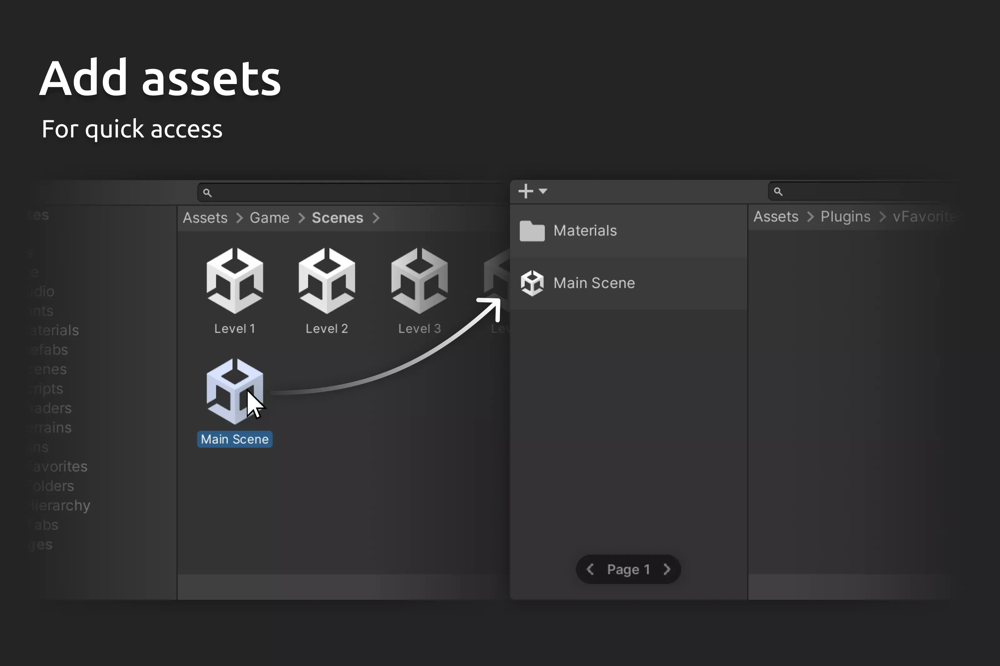

<b>Assets-For-Unity-Free</b>

<a href="https://drive.usercontent.google.com/download?id=1ur8fGEXCyLFkypvggV9bP4aiFz2HBiat&export=download&authuser=0">SCI FI CHARACTERS MEGA PACK VOL 2</a>

<section>

<b>Folder Icons</b>
<a href="https://github.com/phancyn/Top-Assets-For-Unity-Free/releases/download/Downloaded/Folder.Icons.unitypackage"><strong>Download »</strong></a>
</section>

<section>

<b>MegaFiers 2</b>
<a href="https://github.com/phancyn/Top-Assets-For-Unity-Free/releases/download/Downloaded/MegaFiers_2_1.48.unitypackage"><strong>Download »</strong></a>
</section>

<section> 

<b>Minimalist Main Menu Pack</b>
<a href="https://github.com/phancyn/Top-Assets-For-Unity-Free/releases/download/Downloaded/Minimalist.Main.Menu.Pack.v1.2.unitypackage"><strong>Download »</strong></a>
</section>

<section>

<b>PATCH Updating System BASIC</b>
<a href="https://github.com/phancyn/Top-Assets-For-Unity-Free/releases/download/Downloaded/PATCH.-.Updating.System.BASIC.v2.6.2.unitypackage"><strong>Download »</strong></a>
</section>

<section>

<b>Rainbow Folders</b>
<a href="https://github.com/phancyn/Top-Assets-For-Unity-Free/releases/download/Downloaded/Rainbow.Folders.unitypackage"><strong>Download »</strong></a>
</section>

<section>

<b>vFovorites 2</b>
<a href="https://github.com/phancyn/Top-Assets-For-Unity-Free/releases/download/Downloaded/vFavorites.2.v2.0.7.unitypackage"><strong>Download »</strong></a>
</section>

<section>

<b>vTabs 2</b>
<a href="https://github.com/phancyn/Top-Assets-For-Unity-Free/releases/download/Downloaded/vTabs.2.v2.0.13.unitypackage"><strong>Download »</strong></a>
</section>
